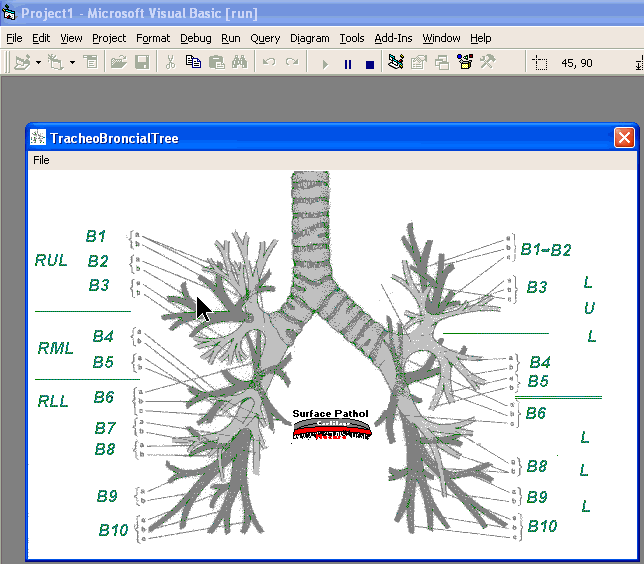



## Tracheobronchial Tree

### Description

This is a graphic representation of the anatomy of your tracheobronchial tree (windpipe and airways) as viewed with a digital bronchoscope. This will eventually include the ability to record realtime findings and generate a report suitable for charting. At present it is only medically educational.
 
### More Info
 

             |
---                |---
**Submitted On**   |2007-08-29 19:46:00
**By**             |[Warren Goff](https://github.com/Planet-Source-Code/PSCIndex/blob/master/ByAuthor/warren-goff.md)
**Level**          |Beginner
**User Rating**    |5.0 (10 globes from 2 users)
**Compatibility**  |VB 6\.0
**Category**       |[Miscellaneous](https://github.com/Planet-Source-Code/PSCIndex/blob/master/ByCategory/miscellaneous__1-1.md)
**World**          |[Visual Basic](https://github.com/Planet-Source-Code/PSCIndex/blob/master/ByWorld/visual-basic.md)
**Archive File**   |[Tracheobro2081208292007\.zip](https://github.com/Planet-Source-Code/warren-goff-tracheobronchial-tree__1-69224/archive/master.zip)

